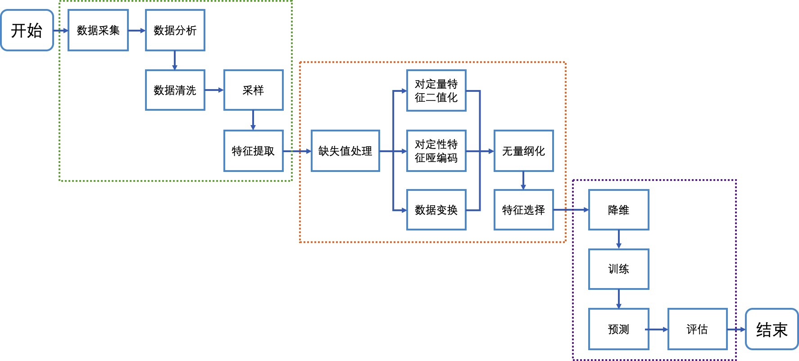

# Practice_Projecs
## Zhixiang Wang

机器学习与数据挖掘个人基础练习项目，在实践中运用并掌握ML算法与框架，打下坚实的基础。 

* 数据分析处理过程
 

* 1.数据分析
    * 下载并加载数据
    * 了解每列数据的含义,数据的格式等，观察每个变量特征的意义以及对于问题的重要程度
    * 数据初步分析,通过绘图:初步了解数据之间的相关性,为构造特征工程以及模型建立做准备

* 2.特征工程
    * 将特征转换为模型可以辨别的类型(如处理缺失值,异常值处理，处理文本进行等)

* 3.模型选择
    * 根据目标函数确定学习类型,是无监督学习还是监督学习,是分类问题还是回归问题等选择合适的模型
    * 比较各个模型的分数,取效果较好的模型作为基础模型

* 4.集成学习——模型融合
    * 训练多个模型，然后按照一定的方法集成多个模型，应为它容易理解、实现也简单，同时效果也很好
    * 包括bagging，Boosting两种思想的方法

* 5.修改特征和模型参数
    * 可以通过添加或者修改特征,提高模型的上限
    * 通过修改模型的参数,使模型逼近上限
          

### - Titanic生存预测
Kaggle基础分类项目，数据特征包含乘客的信息特征，如姓名、年龄、性别、票价等，与是否获救的label（二分类，1 or 0），运用Python和机器学习的相关模型来预测哪些乘客幸免于难。

### -20Newsgroups
20newsgroups数据集是用于文本分类、文本挖据和信息检索研究的国际标准数据集之一。数据集收集了大约20,000左右的新闻组文档，均匀分为20个不同主题的新闻组集合。

### -Mnist手写数字及Fashion_Mnist物体识别
MNIST数据集是一个手写数字数据集，每一张图片都是0到9中的单个数字。数据库主要包含了60000张的训练图像和10000张的测试图像。 
Fashion_Mnist则涵盖了来自10种类别的共7万个不同商品的正面图片。 
项目运用机器学习基础算法与卷积神经网络分别对minst与fashion mnist构建多分类分类模型，并比较各算法模型在时间空间及auc上的优劣。

### -Kobe_Bryant_Shot_Selection科比投篮预测
Kaggle基础分类项目，提供了一个Kobe Bryant Shot Selection(科比投篮选择)的竞赛项目公开数据集，涵盖了科比近20年职业生涯中所尝试的每个投篮命中的位置和情况(30697条记录)。分析科比在退役执以前20年篮球生涯的所有数据，探索他的进攻策略和投篮倾向等。

### -Iris_Analyse
Iris Data Set（鸢尾属植物数据集）是历史最悠久的数据集之一，它首次出现在著名的英国统计学家和生物学家Ronald Fisher 1936年的论文《The use of multiple measurements in taxonomic problems》中，被用来介绍线性判别式分析。 
在这个数据集中，包括了三类不同的鸢尾属植物：Iris Setosa，Iris Versicolour，Iris Virginica。每类收集了50个样本，每个样本4个特征参数（萼片长度和宽度、花瓣长度和宽度）。因此这个数据集一共包含了150个样本。

### -Rent_Predict
数据集为在租房类网站爬取的租房数据，数据信息特征包括房屋地址、楼层、面积、室内等，以及label-房租。 
项目通过构建回归模型，通过已有数据预测新增房屋的租金范围。

